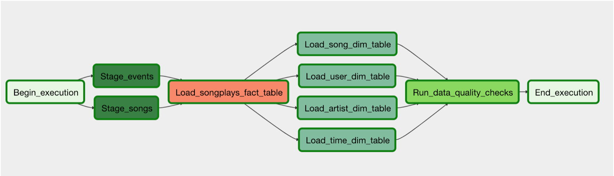
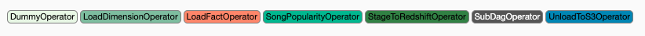
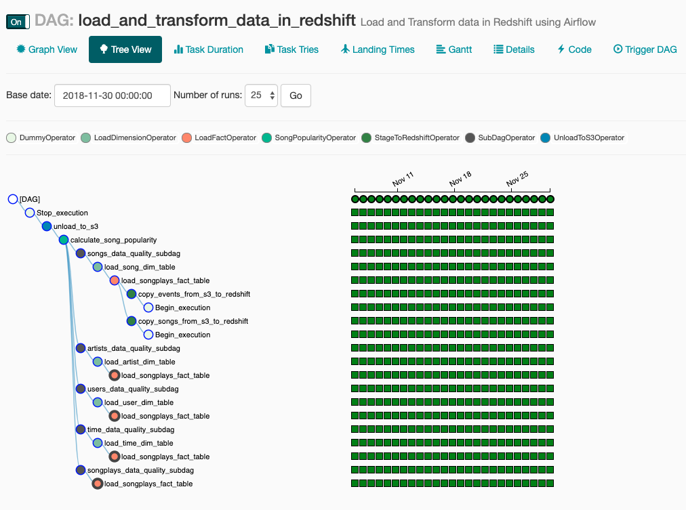

## Project: Data Pipelines with Airflow
**Project Description**: A music streaming company wants to introduce more automation and monitoring to their data warehouse ETL pipelines and they have come to the conclusion that the best tool to achieve this is **Apache Airflow**. As their Data Engineer, I was tasked to create a reusable production-grade data pipeline that incorporates data quality checks and allows for easy backfills. Several analysts and Data Scientists rely on the output generated by this pipeline and it is expected that the pipeline runs daily on a schedule by pulling new data from the source and store the results to the destination.

**Data Description**: The source data resides in S3 and needs to be processed in a data warehouse in Amazon Redshift. The source datasets consist of JSON logs that tell about user activity in the application and JSON metadata about the songs the users listen to.

**Data Pipeline design**:
At a high-level the pipeline does the following tasks.
1. Extract data from multiple S3 locations.
2. Load the data into Redshift cluster.
3. Transform the data into a star schema.
4. Perform data validation and data quality checks.
5. Calculate the most played songs for the specified time interval.
6. Load the result back into S3.


> Structure of the Airflow DAG


**Design Goals**:
Based on the requirements of our data consumers, our pipeline is required to adhere to the following guidelines:
* The DAG should not have any dependencies on past runs.
* On failure, the task is retried for 3 times.
* Retries happen every 5 minutes.
* Catchup is turned off.
* Do not email on retry. 

**Pipeline Implementation**:

Apache Airflow is a Python framework for programmatically creating workflows in DAGs, e.g. ETL processes, generating reports, and retraining models on a daily basis. The Airflow UI automatically parses our DAG and creates a natural representation for the movement and transformation of data. A DAG simply is a collection of all the tasks you want to run, organized in a way that reflects their relationships and dependencies. A **DAG** describes *how* you want to carry out your workflow, and **Operators** determine *what* actually gets done. 

By default, airflow comes with some simple built-in operators like `PythonOperator`, `BashOperator`, `DummyOperator` etc., however, airflow lets you extend the features of a `BaseOperator` and create custom operators. For this project, I developed several custom operators. 



The description of each of these operators follows:
- **StageToRedshiftOperator**: Stages data to a specific redshift cluster from a specified S3 location. Operator uses templated fields to handle partitioned S3 locations.
- **LoadFactOperator**: Loads data to the given fact table by running the provided sql statement. Supports delete-insert and append style loads.
- **LoadDimensionOperator**: Loads data to the given dimension table by running the provided sql statement. Supports delete-insert and append style loads.
- **SubDagOperator**: Two or more operators can be grouped into one task using the SubDagOperator. Here, I am grouping the tasks of checking if the given table has rows and then run a series of data quality sql commands.
    - **HasRowsOperator**: Data quality check to ensure that the specified table has rows.
    - **DataQualityOperator**: Performs data quality checks by running sql statements to validate the data.
- **SongPopularityOperator**: Calculates the top ten most popular songs for a given interval. The interval is dictated by the DAG schedule.
- **UnloadToS3Operator**: Stores the analysis result back to the given S3 location.

> Code for each of these operators is located in the **plugins/operators** directory.

**Pipeline Schedule and Data Partitioning**: 
The events data residing on S3 is partitioned by *year* (2018) and *month* (11). Our task is to incrementally load the event json files, and run it through the entire pipeline to calculate song popularity and store the result back into S3. In this manner, we can obtain the top songs per day in an automated fashion using the pipeline. Please note, this is a trivial analyis, but you can imagine other complex queries that follow similar structure.

*S3 Input events data*:
```bash
s3://<bucket>/log_data/2018/11/
2018-11-01-events.json
2018-11-02-events.json
2018-11-03-events.json
..
2018-11-28-events.json
2018-11-29-events.json
2018-11-30-events.json
```

*S3 Output song popularity data*:
```bash
s3://skuchkula-topsongs/
songpopularity_2018-11-01
songpopularity_2018-11-02
songpopularity_2018-11-03
...
songpopularity_2018-11-28
songpopularity_2018-11-29
songpopularity_2018-11-30
```

The DAG can be configured by giving it some default_args which specify the `start_date`, `end_date` and other design choices which I have mentioned above.

```python
default_args = {
    'owner': 'shravan',
    'start_date': datetime(2018, 11, 1),
    'end_date': datetime(2018, 11, 30),
    'depends_on_past': False,
    'email_on_retry': False,
    'retries': 3,
    'retry_delay': timedelta(minutes=5),
    'catchup_by_default': False,
    'provide_context': True,
}
```

## How to run this project?
***Step 1: Create AWS Redshift Cluster using either the console or through the notebook provided in `create-redshift-cluster`***

Run the notebook to create AWS Redshift Cluster. Make a note of:
- DWN_ENDPOINT ::  dwhcluster.c4m4dhrmsdov.us-west-2.redshift.amazonaws.com
- DWH_ROLE_ARN ::  arn:aws:iam::506140549518:role/dwhRole

***Step 2: Start Apache Airflow***

Run `docker-compose up` from the directory containing `docker-compose.yml`. Ensure that you have mapped the volume to point to the location where you have your DAGs.

> **NOTE: You can find details of how to manage Apache Airflow on mac here:** https://gist.github.com/shravan-kuchkula/a3f357ff34cf5e3b862f3132fb599cf3


***Step 3: Configure Apache Airflow Hooks***

On the left is the `S3 connection`. The Login and password are the IAM user's access key and secret key that you created. Basically, by using these credentials, we are able to read data from S3.

On the right is the `redshift connection`. These values can be easily gathered from your Redshift cluster


***Step 4: Execute the create-tables-dag***

This dag will create the staging, fact and dimension tables. The reason we need to trigger this manually is because, we want to keep this out of main dag. Normally, creation of tables can be handled by just triggering a script. But for the sake of illustration, I created a DAG for this and had Airflow trigger the DAG. You can turn off the DAG once it is completed. After running this DAG, you should see all the tables created in the AWS Redshift.

***Step 5: Turn on the `load_and_transform_data_in_redshift` dag***

As the execution start date is `2018-11-1` with a schedule interval `@daily` and the execution end date is `2018-11-30`, Airflow will automatically trigger and schedule the dag runs once per day for 30 times. Shown below are the 30 DAG runs ranging from start_date till end_date, that are trigged by airflow once per day. 


