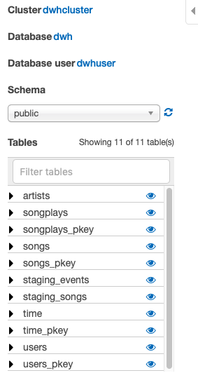

## Project: Data Pipelines with Airflow
**Project Description**: A music streaming company wants to introduce more automation and monitoring to their data warehouse ETL pipelines and they have come to the conclusion that the best tool to achieve this is **Apache Airflow**. As their Data Engineer, I was tasked to create a reusable production-grade data pipeline that incorporates data quality checks and allows for easy backfills. Several analysts and Data Scientists rely on the output generated by this pipeline and it is expected that the pipeline runs daily on a schedule by pulling new data from the source and store the results to the destination.

**Data Description**: The source data resides in S3 and needs to be processed in a data warehouse in Amazon Redshift. The source datasets consist of JSON logs that tell about user activity in the application and JSON metadata about the songs the users listen to.

**Data Pipeline design**:
At a high-level the pipeline does the following tasks. This is represented as a airflow DAG shown below:
1. Extract data from multiple S3 locations.
2. Load the data into Redshift cluster.
3. Transform the data into a star schema.
4. Perform data validation and data quality checks.
5. Calculate the most played songs for the specified time interval.
6. Load the result back into S3.

The structure of the Airflow DAG looks like this:

## Pipeline Design

Several custom operators have been developed for this project:

The description of each of these operators follows:
- **StageToRedshiftOperator**: 
- **LoadFactOperator**:
- **LoadDimensionOperator**:
- **SubDagOperator**:
    - **HasRowsOperator**:
    - **DataQualityOperator**:
- **SongPopularityOperator**:
- **UnloadToS3Operator**:

## Catchup
An Airflow DAG with a start_date, possibly an end_date, and a schedule_interval defines a series of intervals which the scheduler turns into individual Dag Runs and executes them. A key capability of Airflow is that these DAG Runs are atomic, idempotent items, and the scheduler, by default, will examine the lifetime of the DAG (from start to end/now, one interval at a time) and kick off a DAG Run for any interval that has not been run (or has been cleared). This concept is called Catchup.

## How to run this project?
### Step 1: Create the AWS Redshift Cluster
Run the notebook to create AWS Redshift Cluster. Make a note of:
- DWN_ENDPOINT ::  dwhcluster.c4m4dhrmsdov.us-west-2.redshift.amazonaws.com
- DWH_ROLE_ARN ::  arn:aws:iam::506140549518:role/dwhRole

### Step 2: Start Apache Airflow 
Run `docker-compose up` from the directory containing `docker-compose.yml`. Ensure that you have mapped the volume to point to the location where you have your DAGs.

> **NOTE: You can find details of how to manage Apache Airflow on mac here:** https://gist.github.com/shravan-kuchkula/a3f357ff34cf5e3b862f3132fb599cf3

### Step 3: Configure Apache Airflow Hooks
On the left is the `S3 connection`. The Login and password are the IAM user's access key and secret key that you created. Basically, by using these credentials, we are able to read data from S3.

On the right is the `redshift connection`. These values can be easily gathered from your Redshift cluster

### Step 4: Execute the create-tables-dag
This dag will create the staging, fact and dimension tables. The reason we need to trigger this manually is because, we want to keep this out of main dag. Normally, creation of tables can be handled by just triggering a script. But for the sake of illustration, I created a DAG for this and had Airflow trigger the DAG. You can turn off the DAG once it is completed. After running this DAG, you should see all the tables created in the AWS Redshift Query Editor:

### Step 5: Turn on the `load_and_transform_data_in_redshift` dag
As the execution start date is `2018-11-1` with a schedule interval `@daily` and the execution end date is `2018-11-30`, Airflow will automatically trigger and schedule the dag runs once per day for 30 times.
