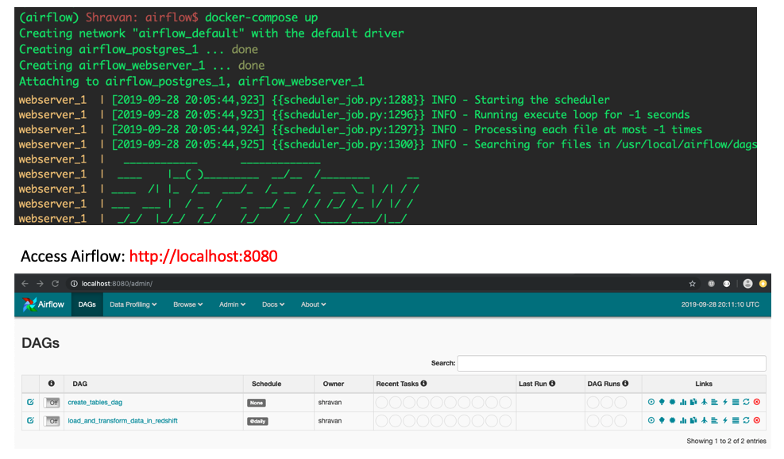

## Introduction
This project will introduce you to the core concepts of Apache Airflow. To complete the project, you will need to create your own custom operators to perform tasks such as:
- staging the data
- filling the data warehouse
- running checks on the data as the final step

The project template package contains three major components for the project:

- The dag template has all the imports and task templates in place, but the task dependencies have not been set
- The operators folder with operator templates
- A helper class for the SQL transformations

Four different operators are developed for this purpose:
- **StageToRedshift**: 
- **LoadFactTable**:
- **LoadDimensionTable**:
- **DataQuality**:

## Catchup
An Airflow DAG with a start_date, possibly an end_date, and a schedule_interval defines a series of intervals which the scheduler turn into individual Dag Runs and execute. A key capability of Airflow is that these DAG Runs are atomic, idempotent items, and the scheduler, by default, will examine the lifetime of the DAG (from start to end/now, one interval at a time) and kick off a DAG Run for any interval that has not been run (or has been cleared). This concept is called Catchup.

## How to run this project?
### Step 1: Create the AWS Redshift Cluster
Run the notebook to create AWS Redshift Cluster. Make a note of:
- DWN_ENDPOINT ::  dwhcluster.c4m4dhrmsdov.us-west-2.redshift.amazonaws.com
- DWH_ROLE_ARN ::  arn:aws:iam::506140549518:role/dwhRole

### Step 2: Start Apache Airflow 
Run `docker-compose up` from the directory containing `docker-compose.yml`. Ensure that you have mapped the volume to point to the location where you have your DAGs.

> **NOTE: You can find details of how to manage Apache Airflow on mac here:** https://gist.github.com/shravan-kuchkula/a3f357ff34cf5e3b862f3132fb599cf3

### Step 3: Configure Apache Airflow Hooks
On the left is the `S3 connection`. The Login and password are the IAM user's access key and secret key that you created. Basically, by using these credentials, we are able to read data from S3.

On the right is the `redshift connection`. These values can be easily gathered from your Redshift cluster

### Step 4: Execute the create-tables-dag
This dag will create the staging, fact and dimension tables. The reason we need to trigger this manually is because, we want to keep this out of main dag. Normally, creation of tables can be handled by just triggering a script. But for the sake of illustration, I created a DAG for this and had Airflow trigger the DAG. You can turn off the DAG once it is completed. At this moment, you should see all the tables created in the AWS Redshift Query Editor:

### Step 5: Turn on the `load_and_transform_data_in_redshift` dag
As the execution start date is `2018-11-1` with a schedule interval `@daily` and the execution end date is `2018-11-30`, Airflow will automatically trigger and schedule the dag runs once per day for 30 times.
