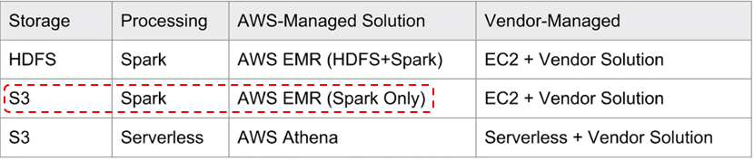
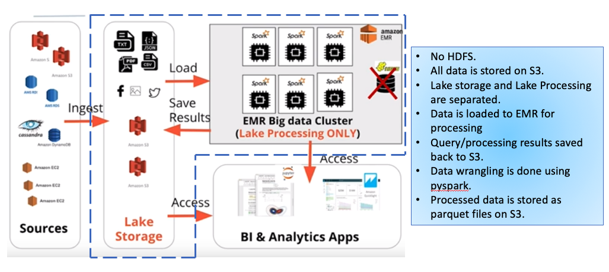
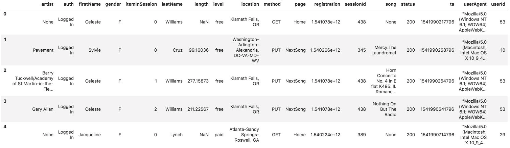
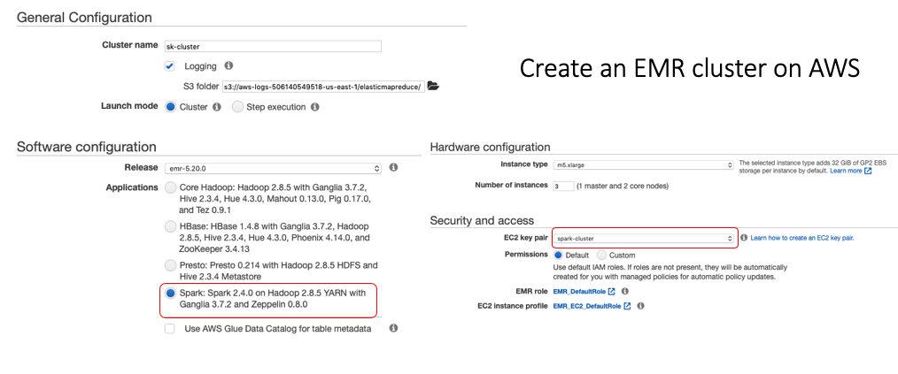
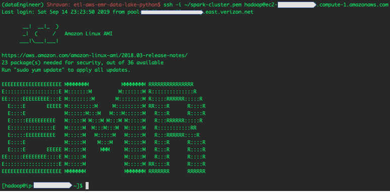
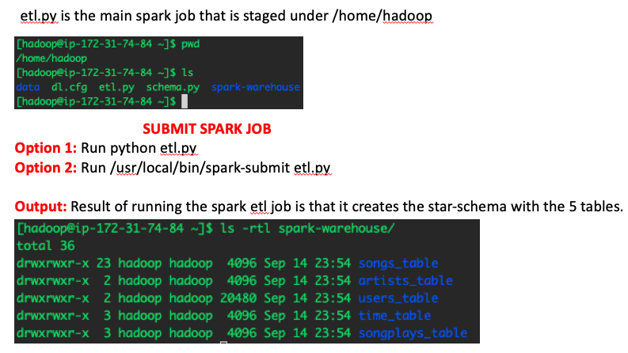

## Data Lakes with Spark 

## Introduction

The goal of this project is to build an ETL pipeline for a Data Lake that extracts data from S3, processes the data using Spark, and loads the data back into S3 as a set of dimensional tables. 

There are several options when it comes to creating Data Lakes on AWS. Essentially it boils down to choosing what type of storage we want, the processing engine we want and whether we are using AWS-Managed solution or a Vendor managed solution.



The **dotted red line** is the option we will be using for this project: **Spark for processing and AWS EMR as our managed solution, and S3 for retrieving and storing our data.** A pictorial representation is shown below. The focus of this project is on the **dotted blue line**. 

* **Lake Storage**: S3
* **Lake Processing**: Spark 




## Motivation
A music streaming startup, Sparkify, has grown their user base and song database even more and want to move their data warehouse to a data lake. Their data resides in S3, in a directory of JSON logs on user activity on the app, as well as a directory with JSON metadata on the songs in their app.

As their data engineer, you are tasked with building an ETL pipeline that extracts their data from S3, processes them using Spark, and loads the data back into S3 as a set of dimensional tables. This will allow their analytics team to continue finding insights in what songs their users are listening to.

## Technology


## Data description
There are two main datasets that reside in S3.
* **Song data**: `s3://udacity-dend/song-data/`
* **Log data**: `s3://udacity-dend/log-data/`

The log format is captured in `s3://udacity-dend/log_json_path.json`

### Song dataset
The first dataset is a subset of real data from the Million Song Dataset. Each file is in JSON format and contains metadata about a song and the artist of that song. The files are partitioned by the first three letters of each song's track ID. For example, here are filepaths to two files in this dataset.

```
song_data/A/B/C/TRABCEI128F424C983.json
song_data/A/A/B/TRAABJL12903CDCF1A.json
```
And below is an example of what a single song file, TRAABJL12903CDCF1A.json, looks like.

```
{"num_songs": 1, "artist_id": "ARJIE2Y1187B994AB7", "artist_latitude": null, "artist_longitude": null, "artist_location": "", "artist_name": "Line Renaud", "song_id": "SOUPIRU12A6D4FA1E1", "title": "Der Kleine Dompfaff", "duration": 152.92036, "year": 0}
```

### Log dataset
The second dataset consists of log files in JSON format generated by this event simulator based on the songs in the dataset above. These simulate app activity logs from an imaginary music streaming app based on configuration settings.

The log files in the dataset you'll be working with are partitioned by year and month. For example, here are filepaths to two files in this dataset.

```
log_data/2018/11/2018-11-12-events.json
log_data/2018/11/2018-11-13-events.json
```

And below is an example of what the data in a log file, 2018-11-12-events.json, looks like.



## Project Structure
* **etl.py**: The script reads song_data and load_data from S3, transforms them to create five different tables, and writes them to partitioned parquet files in table directories on S3.
* **schema.py**: The script captures the column names as per star-schema design.
* **dl.cfg**: Contains credentials for accessing S3.
* **Local.ipynb**: Notebook for trying things out locally before putting them into a script.
* **data**: A sample of song_data and log_data saved locally for testing before going to S3.
* **spark-warehouse**: Output tables written to parquet files. Each table has its own directory. 
    * artist table files
    * users table files
    * songs table files are partitioned by **year** and **artist**. 
    * time table files are partitioned by **year** and **month**. 
    * songplays table is partitioned by **year** and **month**.

## Methodology
The script reads song_data and load_data from S3, transforms them to create five different tables, and writes them to partitioned parquet files in table directories on S3. 

A simple star schema was employed for designing the tables.
<p align="middle">
  

## How to run this project on AWS EMR?
### Create a Data Lake with Spark and AWS EMR.
To create an Elastic Map Reduce data lake on AWS, use the following steps:

1. Create a ssh key-pair to securely connect to the EMR cluster that we are going to create. Go to your EC2 dashboard and click on the key-pairs. Create a new one, you will get a .pem file that you need to use to securely connect to the cluster.

2. Next, we will create an EMR cluster with the following configuration. Here EMR operates Spark in YARN cluster mode and comes with Hadoop Distributed file system. We will use a 4 cluster node with 1 master and 3 worker nodes.



3. We will be using the default security group and the default EMR role `EMR_DefaultRole` for our purposes. Ensure that default security group associated with Master node has SSH inbound rule open, otherwise you won't be able to ssh. 

### Submitting Spark Jobs to the cluster
1. Once the cluster is ready, we can ssh into the master node from your terminal session. This will connect you to the EMR cluster.


2. Now you can transfer your files to /home/hadoop and then run the `spark-submit` command to submit your spark jobs. Make sure you update the `dl.cfg` with your S3 creds.



> Note: Since the master node does not have some python libraries, you may have to **sudo pip install python-library**.

## How to run this project locally?
As the size of the data located on S3 is quite large, I have also provided an option to run this project locally. That is, instead of retrieving the data from S3, you can retrieve the data from `data` directory, then process it on the EMR cluster and store the result back locally to `spark-warehouse`. This is especially useful to iteratively develop your processing logic, without waiting for a long time to load data from S3.

To do so, run the etl-local.py

