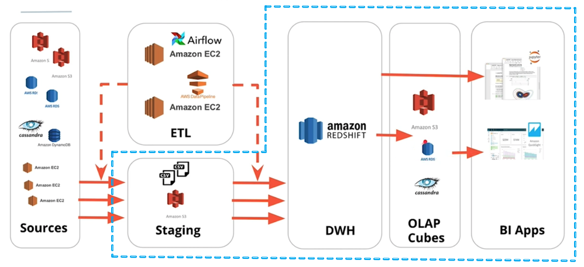
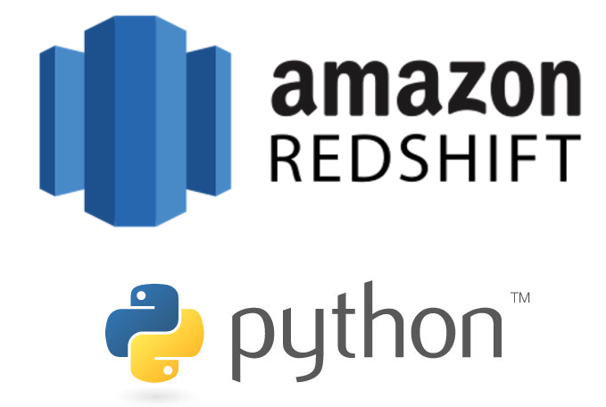
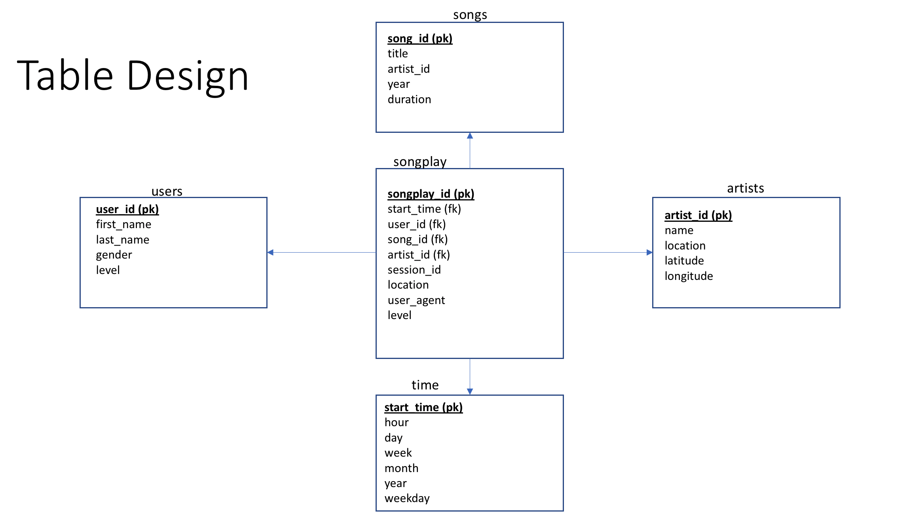

## Introduction

The goal of this project is to build an ETL pipeline for a database hosted on Redshift. Depicted in the below figure is the role of RedShift in the overall data engineering landscape. Our focus in this project is on the **blue dotted line**, where we have some data on S3 and we are tasked to build an ETL pipeline that extracts this data from S3, stages them in Redshift, and transforms the data into a set of fact and dimension tables for the BI applications to consume.


> Source: Data Engineering Nanodegree

## Motivation
A music streaming startup, Sparkify, has grown their user base and song database and want to move their processes and data onto the cloud. Their data resides in S3, in a directory of JSON logs on user activity on the app, as well as a directory with JSON metadata on the songs in their app.

As their data engineer, you are tasked with building an ETL pipeline that extracts their data from S3, stages them in Redshift, and transforms data into a set of dimensional tables for their analytics team to continue finding insights in what songs their users are listening to. 


## Data description
There are two main datasets that reside in S3. 
* **Song data**: `s3://udacity-dend/song-data/`
* **Log data**: `s3://udacity-dend/log-data/`

The log format is captured in `s3://udacity-dend/log_json_path.json`

### Song dataset
The first dataset is a subset of real data from the Million Song Dataset. Each file is in JSON format and contains metadata about a song and the artist of that song. The files are partitioned by the first three letters of each song's track ID. For example, here are filepaths to two files in this dataset.

```
song_data/A/B/C/TRABCEI128F424C983.json
song_data/A/A/B/TRAABJL12903CDCF1A.json
```
And below is an example of what a single song file, TRAABJL12903CDCF1A.json, looks like.

```
{"num_songs": 1, "artist_id": "ARJIE2Y1187B994AB7", "artist_latitude": null, "artist_longitude": null, "artist_location": "", "artist_name": "Line Renaud", "song_id": "SOUPIRU12A6D4FA1E1", "title": "Der Kleine Dompfaff", "duration": 152.92036, "year": 0}
```

### Log dataset
The second dataset consists of log files in JSON format generated by this event simulator based on the songs in the dataset above. These simulate app activity logs from an imaginary music streaming app based on configuration settings.

The log files in the dataset you'll be working with are partitioned by year and month. For example, here are filepaths to two files in this dataset.

```
log_data/2018/11/2018-11-12-events.json
log_data/2018/11/2018-11-13-events.json
```

And below is an example of what the data in a log file, 2018-11-12-events.json, looks like.


## Technology
<p align="middle">
  
    
## Methodology
A simple star schema was employed for designing the tables.
<p align="middle">
  
    
## Project Structure
* **create-aws-redshift-using-iac.ipynb**: This notebook contains instructions for launching a AWS Redshift cluster using infrastructure-as-code.
* **create_tables.py**: Script for creating the staging and star-schema tables.
* **etl.py**: Script for loading data into staging tables and then inserting data into star-schema.
* **sql_queries.py**: Script contains all the queries used by `create_tables.py` and `etl.py`.
* **dwh-iac.cfg**: Configuration file for creating RedShift cluster, used by `create-aws-redshift-using-iac.ipynb` notebook.
* **dwh.cfg**: Configuration file used by `create_tables.py` and `etl.py`.
    
## How to run this project?

> Note: Make sure you populate the **dwh.cfg and dwh-iac.cfg** files. 

* **Step 1:**: Create and launch AWS Redshift cluster by following `create-aws-redshift-using-iac.ipynb PART 1`.
* **Step 2:**: From terminal, run `python create_tables.py`
* **Step 3:**: From terminal, run `python etl.py`

After, running these 3 steps, data will be available for analysis.
