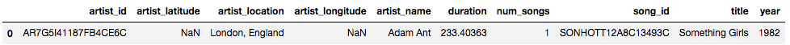
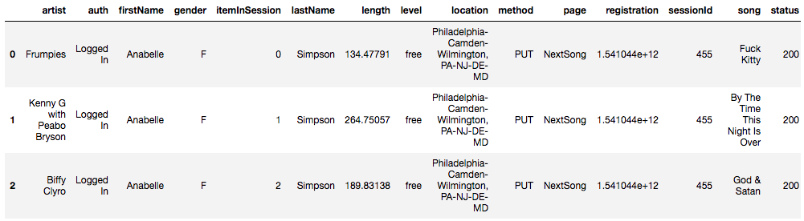

## Introduction
The Sparify team wants to analyze the songs and activity logs data that is generated from a music streaming app. They want to build an ETL pipeline which will extract the data from the song and activity json files and stores them in a database for doing some analysis. 

## Project description
The goal of SparkifyDB is to serve as a database for storing information that is extracted from the log and song data json files. By creating a data model, we are able to extract relevant information from these json files and store them in our database. Later, this transformed and pre-processed data can be used for analytic query purposes.

## Explore the data
There are two different datasets: Song Dataset and Log Dataset. 

### Song Dataset
The first dataset is in JSON format and contains metadata about a song and the artist of that song. The files are partitioned by the first three letters of each song's track ID. For example, here are file paths to two files in this dataset.

```txt
song_data/A/B/C/TRABCEI128F424C983.json
song_data/A/A/B/TRAABJL12903CDCF1A.json
```

And below is an example of what a single song file, TRAAAEF128F4273421.json, looks like.

```json
{"num_songs": 1, 
 "artist_id": "AR7G5I41187FB4CE6C", 
 "artist_latitude": null, 
 "artist_longitude": null, 
 "artist_location": "London, England", 
 "artist_name": "Adam Ant", 
 "song_id": "SONHOTT12A8C13493C", 
 "title": "Something Girls", 
 "duration": 233.40363, 
 "year": 1982}
```

Using pandas, we can convert this to tabular format:


### Log Dataset
The second dataset consists of log files in JSON format. These describe app activity logs from a music streaming app based on specified configurations.

The log files in the dataset are partitioned by year and month. 

For example, here are file paths to two files in this dataset.

```txt
log_data/2018/11/2018-11-05-events.json
log_data/2018/11/2018-11-13-events.json
```

And below is an example of what the data in a log file, 2018-11-05-events.json, looks like.
```json
{"artist":"Frumpies","auth":"Logged In","firstName":"Anabelle","gender":"F","itemInSession":0,"lastName":"Simpson","length":134.47791,"level":"free","location":"Philadelphia-Camden-Wilmington, PA-NJ-DE-MD","method":"PUT","page":"NextSong","registration":1541044398796.0,"sessionId":455,"song":"Fuck Kitty","status":200,"ts":1541903636796,"userAgent":"\"Mozilla\/5.0 (Macintosh; Intel Mac OS X 10_9_4) AppleWebKit\/537.36 (KHTML, like Gecko) Chrome\/36.0.1985.125 Safari\/537.36\"","userId":"69"}

{"artist":"Kenny G with Peabo Bryson","auth":"Logged In","firstName":"Anabelle","gender":"F","itemInSession":1,"lastName":"Simpson","length":264.75057,"level":"free","location":"Philadelphia-Camden-Wilmington, PA-NJ-DE-MD","method":"PUT","page":"NextSong","registration":1541044398796.0,"sessionId":455,"song":"By The Time This Night Is Over","status":200,"ts":1541903770796,"userAgent":"\"Mozilla\/5.0 (Macintosh; Intel Mac OS X 10_9_4) AppleWebKit\/537.36 (KHTML, like Gecko) Chrome\/36.0.1985.125 Safari\/537.36\"","userId":"69"}

{"artist":"Biffy Clyro","auth":"Logged In","firstName":"Anabelle","gender":"F","itemInSession":2,"lastName":"Simpson","length":189.83138,"level":"free","location":"Philadelphia-Camden-Wilmington, PA-NJ-DE-MD","method":"PUT","page":"NextSong","registration":1541044398796.0,"sessionId":455,"song":"God & Satan","status":200,"ts":1541904034796,"userAgent":"\"Mozilla\/5.0 (Macintosh; Intel Mac OS X 10_9_4) AppleWebKit\/537.36 (KHTML, like Gecko) Chrome\/36.0.1985.125 Safari\/537.36\"","userId":"69"}
```

Using pandas, we can convert this to tabular format:


## Methodology
A simple star schema approach has been chosen to model the data. The fact table here `songplays` captures the details of songs, artists, users, which can then be used to perform several analytic type queries. The supporting dimension tables `users, songs, artists and time` can provide additional details pertaining to the facts. This design provides the flexibility to perform aggregates/rollups etc, without performing too many joins.

#### Fact Table

1. songplays

   \- records in event data associated with song plays i.e. records with page

   ```
   NextSong
   ```

   - *songplay_id, start_time, user_id, level, song_id, artist_id, session_id, location, user_agent*

#### Dimension Tables

1. users

   \- users in the app

   - *user_id, first_name, last_name, gender, level*

2. songs

   \- songs in music database

   - *song_id, title, artist_id, year, duration*

3. artists

   \- artists in music database

   - *artist_id, name, location, lattitude, longitude*

4. time

   \- timestamps of records in songplays table, broken down into specific units

   - *start_time, hour, day, week, month, year, weekday*

There are three main scripts:
* **create_tables.py**: Creates the star schema. 
* **sql_queries.py**: Captures all the SQL queries used for creating the schema and inserting the data.
* **etl.py**: Implements the ETL pipeline by extracting data from song and log data files and inserts them into tables.

## How to run this project locally?
First, install postgres and have it running locally. This [link](https://www.codementor.io/engineerapart/getting-started-with-postgresql-on-mac-osx-are8jcopb) provides it for MacOs. It goes through configuring Postgres, creating users, creating databases using the psql utility. 

Secondly, create the database and run the ETL pipeline as follows:
1. From terminal, run `python create_tables.py`
2. From terminal, run `python etl.py`

> Note: If you want to adjust any queries or create more tables, you can update the *sql_queries.py* script.
